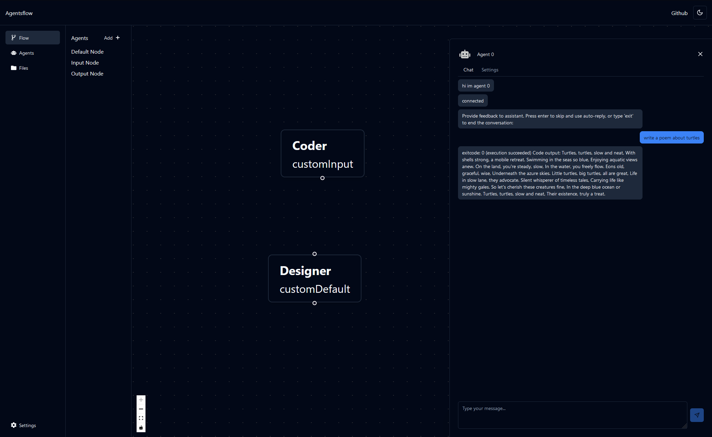

# Agentsflow

## [AutoGen](https://github.com/microsoft/autogen) powered web ui

Create and connect AI agents in your browser.



## Installation:

```bash
conda create --name autogen python=3.9
activate autogen
conda install fastapi[all] websockets python-dotenv pip
pip install pyautogen "pyautogen[blendsearch]"
uvicorn server:app --reload --port 8999
```

## Roadmap

### Backend

- [x] Add websockets to autogen agent
- [ ] Let the agent execute code?
- [ ] Vector database for the agents

### Frontend

- [x] Simple html websocket client
- [ ] Add Tauri with nextjs as a frontend
- [ ] Implement react-flow
- [ ] Drag and drop to add/connect agents
- [ ] Modal to create custom agent
